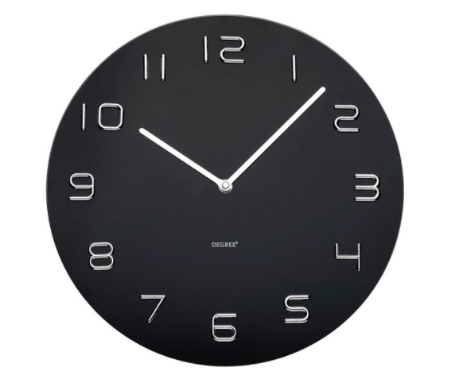

# Cron Jobs

Schedule automatic jobs in Linux

### Layout

| minute | hour | day of month | month | day of week |
| :----- | :--- | :----------- | :---- | :---------- |


### Valid entries
```

* any value

, value list separator

- range of values

/ step values

@yearly

@annually

@monthly

@weekly

@daily

@hourly

@reboot

```

---

### Check Cron for all users

This has to be run as root or superuser.
```
for user in $(cut -f1 -d: /etc/passwd); do crontab -u $user -l; done
```

---
 
